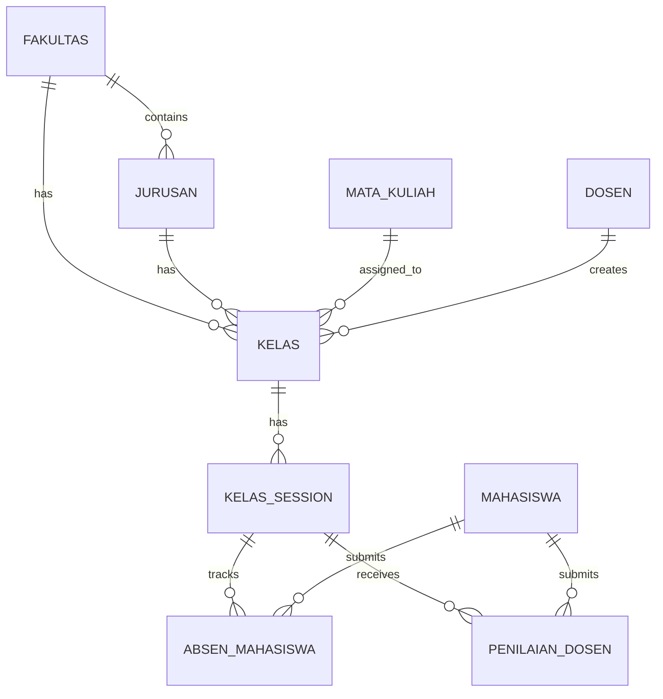
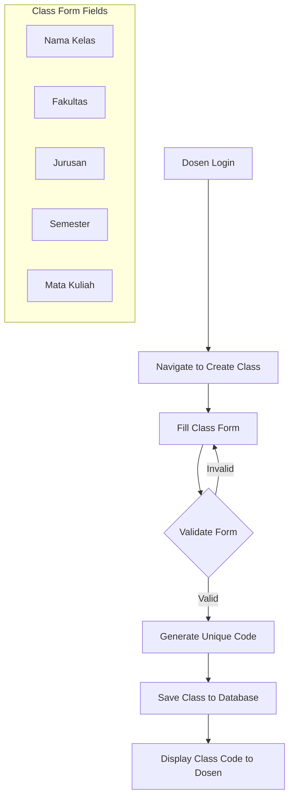
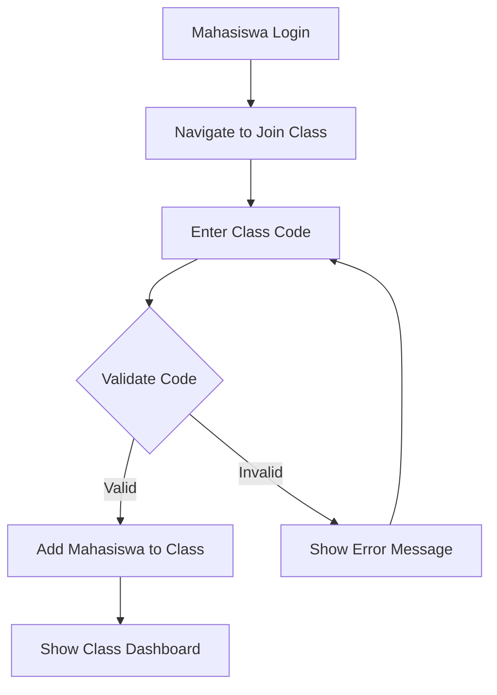
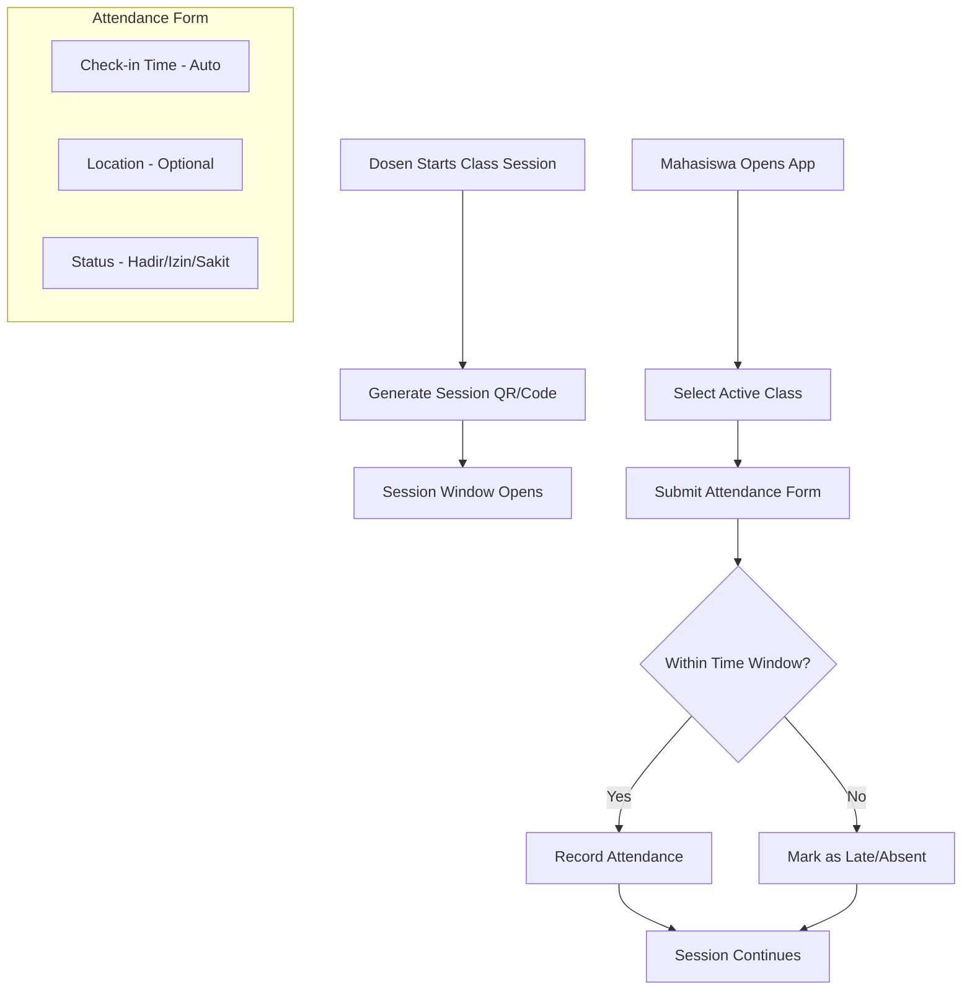
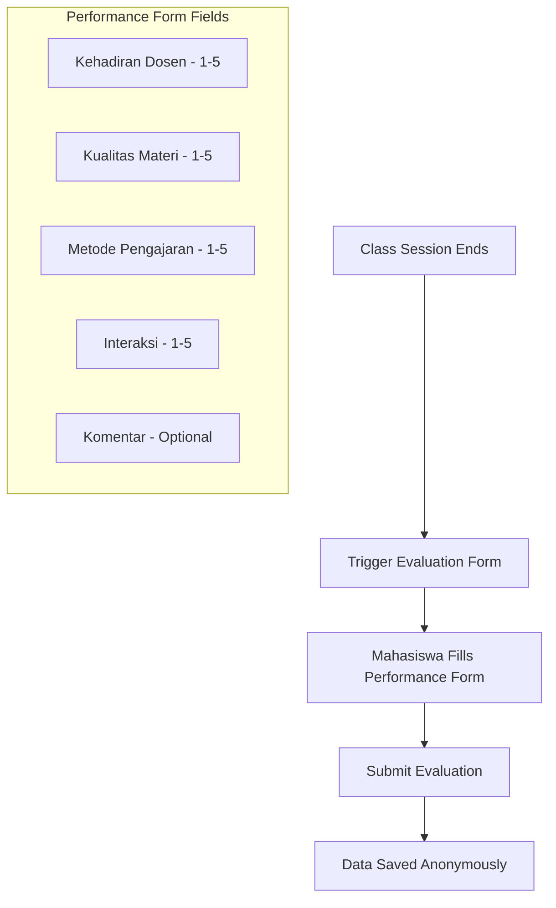
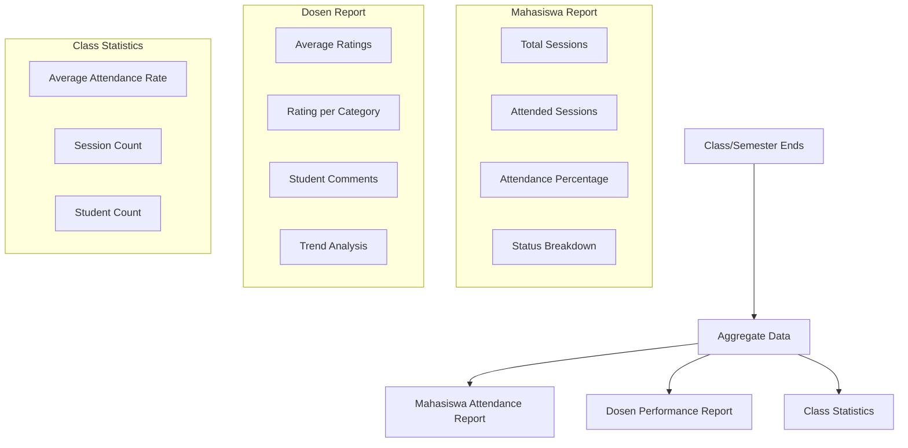

# Praesentia - Attendance Management System Flow

## Overview

Praesentia is an attendance management system for academic institutions. The system manages attendance tracking for classes (kelas), allowing lecturers (dosen) to create classes and students (mahasiswa) to join and submit attendance along with performance evaluations.

---

## User Roles

| Role | Description |
|------|-------------|
| **Admin** | System administrator with full access |
| **Pegawai** | Staff member with faculty-level access |
| **Dosen** | Lecturer who creates and manages classes |
| **Mahasiswa** | Student who joins classes and submits attendance |

---

## Core Entities

---

## Application Flow

### Phase 1: Dosen Creates a Class

#### Required Fields:
- **Nama Kelas**: Class name
- **Kode**: Auto-generated unique 6-character code
- **Fakultas**: Faculty/department
- **Jurusan**: Major/program
- **Mata Kuliah**: Course subject
- **Semester**: Academic semester

---

### Phase 2: Mahasiswa Joins Class

#### Join Process:
1. Mahasiswa receives class code from Dosen
2. Mahasiswa enters the 6-character code
3. System validates the code exists
4. System adds Mahasiswa to the class roster
5. Mahasiswa can now access class sessions

---

### Phase 3: Class Session & Attendance

#### Attendance Status Types:
| Status | Description |
|--------|-------------|
| **Hadir** | Present |
| **Izin** | Excused absence |
| **Sakit** | Sick leave |
| **Alpha** | Unexcused absence |
| **Terlambat** | Late |

---

### Phase 4: Dosen Performance Evaluation

#### Evaluation Criteria:
1. **Kehadiran Dosen**: Lecturer punctuality and presence
2. **Kualitas Materi**: Quality of teaching materials
3. **Metode Pengajaran**: Teaching methodology
4. **Interaksi**: Interaction with students
5. **Komentar**: Additional comments (optional)

---

### Phase 5: Data & Reports Generation

#### Generated Reports:

**Mahasiswa Attendance Report:**
- Total classes attended
- Attendance percentage
- Breakdown by status (hadir, izin, sakit, alpha)
- Attendance trend over time

**Dosen Performance Report:**
- Average rating per category
- Overall performance score
- Student feedback summary
- Comparison across classes/semesters

**Class Statistics:**
- Overall attendance rate
- Most/least attended sessions
- Performance metrics

---

## TODO - Implementation Checklist

### Database Schema Updates
- [ ] Add `semester` field to `kelas` table
- [ ] Add `dosen_id` field to `kelas` table
- [ ] Complete `absenDosen` table with required fields
- [ ] Complete `absenMahasiswa` table with required fields
- [ ] Create `kelasSession` table for class sessions
- [ ] Create `kelasMahasiswa` junction table for class enrollment
- [ ] Create `penilaianDosen` table for performance evaluations

### Dosen Features
- [ ] Create class form with all required fields
- [ ] Unique code generation logic
- [ ] Start/end class session functionality
- [ ] View class roster
- [ ] View attendance summary
- [ ] Export attendance data

### Mahasiswa Features
- [ ] Join class with code
- [ ] View enrolled classes
- [ ] Submit attendance (check-in/check-out)
- [ ] Fill dosen performance form
- [ ] View attendance history

### Reporting Features
- [ ] Mahasiswa attendance report generation
- [ ] Dosen performance report generation
- [ ] Class statistics dashboard
- [ ] Export reports to PDF/Excel

### Admin/Pegawai Features
- [ ] Manage all classes
- [ ] Override attendance records
- [ ] View all reports
- [ ] Manage users and roles

---

## API Endpoints (Suggested)

| Method | Endpoint | Description |
|--------|----------|-------------|
| POST | `/api/kelas` | Create new class |
| GET | `/api/kelas/:id` | Get class details |
| POST | `/api/kelas/join` | Join class with code |
| POST | `/api/session/start` | Start class session |
| POST | `/api/session/end` | End class session |
| POST | `/api/attendance` | Submit attendance |
| POST | `/api/evaluation` | Submit dosen evaluation |
| GET | `/api/reports/attendance/:mahasiswaId` | Get mahasiswa report |
| GET | `/api/reports/dosen/:dosenId` | Get dosen performance |
| GET | `/api/reports/kelas/:kelasId` | Get class statistics |
